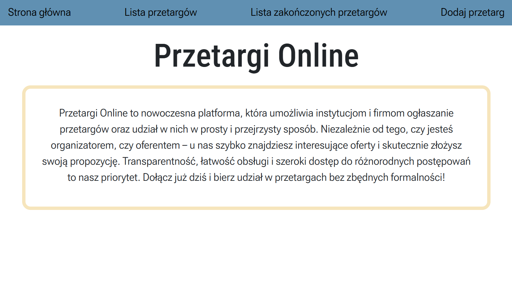
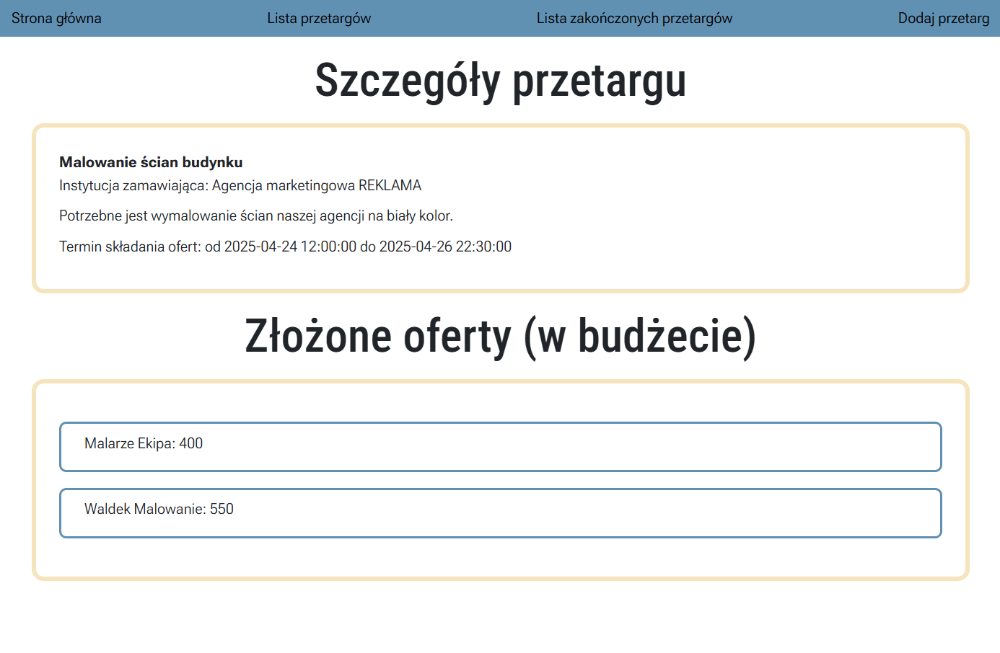

# Aplikacja do ogłaszania przetargów

Strona główna:

## Spis treści
* [Opis projektu](#opis-projektu)
* [Użyte technologie](#użyte-technologie)
* [Instalacja](#instalacja)

## Opis projektu
Projekt został wykonany w ramach przedmiotu Projektowanie Aplikacji Internetowych. 

Jest to aplikacja umożliwiająca ogłaszanie przetargów, dodawanie ofert do przetargów, a także przeglądanie przetargów aktualnych i tych już zakończonych.

Projekt został zbudowany na architekturze warstwowej MVC (Model-View-Controller), przy wykorzystaniu modelu SSR (Server Side Rendering).

## Użyte technologie
Projekt właściwy:
* Express.js
* Node.js
* EJS
* CSS, Bootstrap
* SQLite

Planowanie projektu:
* draw.io - projekt klas *(./assets/planKlas.drawio)*
* Figma - prototyp strony (wstępny projekt) *[Link do podglądu prototypu](https://www.figma.com/proto/kBPMLStwUBGy0y0AGaxXwc/Przetargi-Strona?page-id=0%3A1&node-id=1-2&p=f&viewport=-1164%2C272%2C0.4&t=1SOjlt2sJuV7bUCZ-1&scaling=min-zoom&content-scaling=fixed&starting-point-node-id=1%3A2)*

## Instalacja
Aby uruchomić projekt lokalnie należy:
1. Pobrać projekt z repozytorium: `git clone https://github.com/JustynaGargula/bid-app.git`.
2. Wejść do folderu pobranego projektu: `cd bid-app`.
3. Pobrać potrzebne zależności: `npm install`.
4. Uruchomić aplikację: `npm start`.